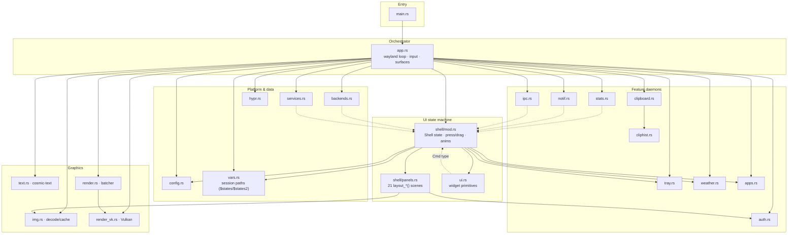
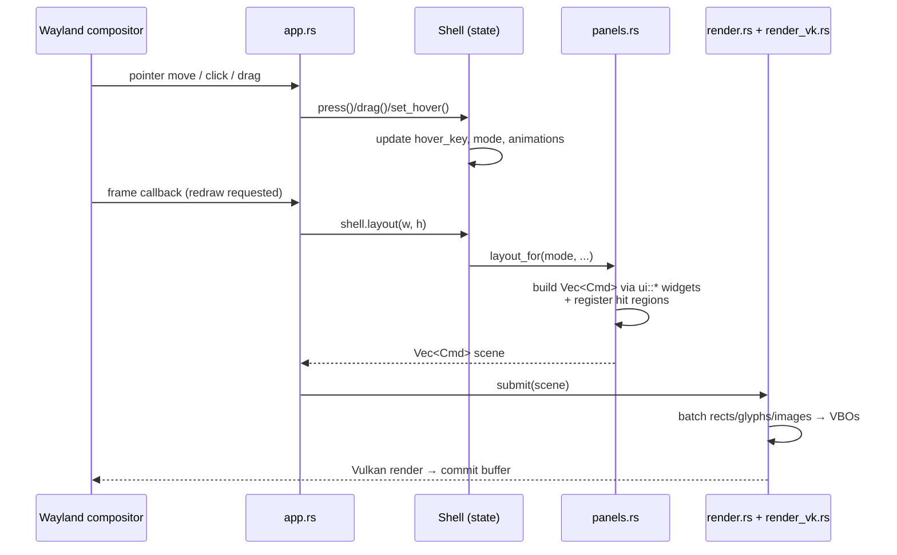

# zen-shell Architecture

Visual map of the Rust quickshell rewrite (~13.7k LOC, 22 modules).

---

## 1. The big picture

```
                                ┌─────────────┐
                                │   main.rs   │  entry, CLI flags
                                └──────┬──────┘
                                       │
                                ┌──────▼──────┐
        Wayland events ───────►│    app.rs   │  orchestrator: event loop,
        timers / signals ─────►│ (3225 LOC)  │  surfaces, input dispatch,
                                └──┬───┬───┬──┘  backend wiring
              ┌────────────────────┘   │   └───────────────────┐
              ▼                        ▼                       ▼
    ┌───────────────────┐   ┌─────────────────────┐   ┌──────────────────┐
    │  SHELL (UI state) │   │  RENDER PIPELINE    │   │  PLATFORM / DATA │
    ├───────────────────┤   ├─────────────────────┤   ├──────────────────┤
    │ shell/mod.rs      │   │ text.rs   fonts     │   │ backends.rs      │
    │  state machine,   │   │ img.rs    images    │   │  sysfs/wpctl/…   │
    │  input, anims     │   │ render.rs batching  │   │ services.rs      │
    │ shell/panels.rs   │   │ render_vk.rs Vulkan │   │  MPRIS, net, …   │
    │  21 panel layouts │   └─────────────────────┘   │ hypr.rs  Hyprland│
    └────────┬──────────┘                             └──────────────────┘
             │ emits Vec<Cmd> (scene)                 ┌──────────────────┐
             ▼                                        │ FEATURE DAEMONS  │
    ┌──────────────────┐                              │ notif  tray      │
    │  ui.rs           │◄──────── uses ───────────────│ clipboard cliphist│
    │  widget library  │                              │ stats  weather   │
    │  chip/tile/slidr │                              │ apps   auth  ipc │
    └──────────────────┘                              └──────────────────┘
```

---

## 2. Module dependency graph



*Dotted arrows = type-only dependencies (`shell::Cmd` scene vocabulary).*

---

### 3a. Bash script style (scripts/)

The helper scripts under `scripts/` are user-facing. Follow these conventions:

- **Avoid external text-munging binaries** when a builtin will do: `$(<file)`
  over `cat`, `${var//[!0-9]/}` over `tr -dc '0-9'`, `${var%% *}` over `cut`,
  `case` over `grep -q`. The rule is about text processing, not the system CLIs
  the scripts wrap (`wpctl`, `pactl`, `hyprctl`, `nmcli`, …).
- **Prefer `(( ))` over `[[ ]]` for arithmetic** — `(( m > max ))` reads like
  math; keep `[[ ]]` for string/pattern/regex tests.
- **Structure as use-case → if/else → function call.** The top-level
  `case "${1:-…}" in` should make the branches obvious.
- **Persist state in `$states2/` files**, re-query the device only when the file
  is missing (`vol_ensure` pattern).
- **Name small formatting helpers** (`vol_fraction`, `mic_fraction`) instead of
  inlining the arithmetic.

---

## 3. Life of one frame



Key idea: **immediate-mode UI** — every frame the active panel rebuilds a flat
`Vec<Cmd>` scene from current state; there is no retained widget tree.
Hit-regions are registered *while drawing*, so what you see is exactly what is clickable.

---

### 4a. Bash script style (scripts/)

The helper scripts under `scripts/` are user-facing. Follow these conventions:

- **Avoid external text-munging binaries** when a builtin will do: `$(<file)`
  over `cat`, `${var//[!0-9]/}` over `tr -dc '0-9'`, `${var%% *}` over `cut`,
  `case` over `grep -q`. The rule is about text processing, not the system CLIs
  the scripts wrap (`wpctl`, `pactl`, `hyprctl`, `nmcli`, …).
- **Prefer `(( ))` over `[[ ]]` for arithmetic** — `(( m > max ))` reads like
  math; keep `[[ ]]` for string/pattern/regex tests.
- **Structure as use-case → if/else → function call.** The top-level
  `case "${1:-…}" in` should make the branches obvious.
- **Persist state in `$states2/` files**, re-query the device only when the file
  is missing (`vol_ensure` pattern).
- **Name small formatting helpers** (`vol_fraction`, `mic_fraction`) instead of
  inlining the arithmetic.

---

## 4. Module inventory

| Module | LOC | Role |
|---|---:|---|
| `app.rs` | 3225 | Wayland event loop, layer surfaces, input dispatch, backend glue |
| `shell/mod.rs` | 1978 | `Shell` state machine: modes, press/drag/hover, animations, morph |
| `shell/panels.rs` | 1788 | All panel layouts → emit `Cmd` scenes |
| `render_vk.rs` | 1150 | Vulkan device/swapchain/pipelines |
| `services.rs` | 675 | MPRIS, network, async service polling |
| `render.rs` | 604 | Scene → vertex batches |
| `backends.rs` | 574 | Pluggable power/brightness/audio/lock/wallpaper backends |
| `img.rs` | 568 | Image decode + texture cache |
| `config.rs` | 563 | TOML config, defaults, atomic save |
| `clipboard.rs` | 348 | Clipboard history service |
| `tray.rs` | 275 | StatusNotifierItem tray |
| `ui.rs` | 245 | Widget primitives: chip/tile/slider/media_btn/bar/card/shadow/text* |
| `hypr.rs` | 242 | Hyprland IPC: workspaces, dispatches |
| `text.rs` | 220 | cosmic-text shaping/rasterization |
| `cliphist.rs` | 210 | cliphist client |
| `auth.rs` | 196 | Lockscreen auth (password verify) |
| `stats.rs` | 168 | CPU/RAM/disk/net sampling |
| `apps.rs` | 168 | .desktop app scanning/launching |
| `ipc.rs` | 160 | Runtime socket commands (`zen-shell open cc`…) |
| `notif.rs` | 148 | Notifications daemon (org.freedesktop.Notifications) |
| `weather.rs` | 137 | Weather fetch/codes |
| `main.rs` | 116 | Entry point |
| `vars.rs` | ~70 | Session-path resolution: `$states` / `$states2` dirs, `channel`, per-state shell config paths |

Panels rendered by `panels.rs`: collapsed pill, dashboard, control center,
launcher, notifications, power, wifi menu, bt menu, weather, audio, wallpaper,
clipboard (+images), notif popup, OSD, workspace switcher, lock, calendar,
settings.

---

## 5. Modularity health check

**Healthy**
- Clear layers: input → state → scene → GPU; no module skips two layers
- Feature isolation: each daemon owns its protocol and can be tested alone
- `backends.rs` + `[backends]` config = swappable implementations (sysfs/wpctl/…)
- No circular dependencies; dotted edges are shared-type only

**Debt (known, non-blocking)**
1. **`app.rs` is now the biggest file** (3225 LOC) — next split candidate
   (e.g. `app/mod.rs` + `input.rs` + `surface.rs`)
2. `Cmd` lives in `shell` but is used by ~10 modules — moving it to a small
   `scene.rs` would invert those dotted arrows cleanly
3. Panels still hand-draw some composites (85 raw `Cmd::Rect`) instead of
   reusing named widgets — see "component reuse" notes

---

*Generated from source inspection on 2026-08-23.*
